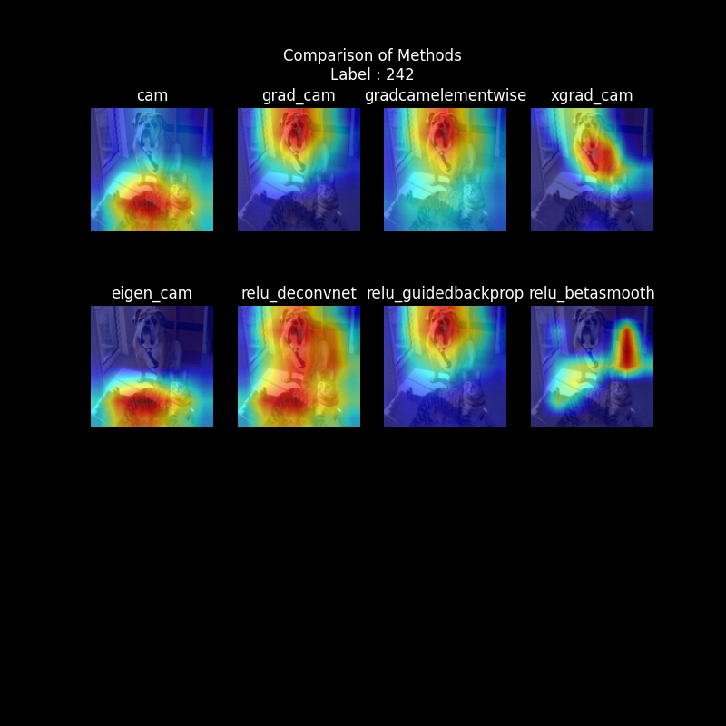

# pytorch_image_attribution
Image Attribution Algos implemented in an easy to understand manner

## How to use
<!-- refer to main.ipynb now, will be refactored and put into proper files later -->
- Refer to `main.ipynb` for example usage
- Since the code is in progress, it will be refactored and put into proper files later

## Example results
- 

## Implemented methods
- [x] CAM
- [x] GradCAM
- [x] Elementwise GradCAM
- [x] XGradCAM
- [x] EigenCAM
- [x] ReLU DeconvNet
- [x] ReLU Guided Backprop
- [ ] ReLU Beta Smooth
